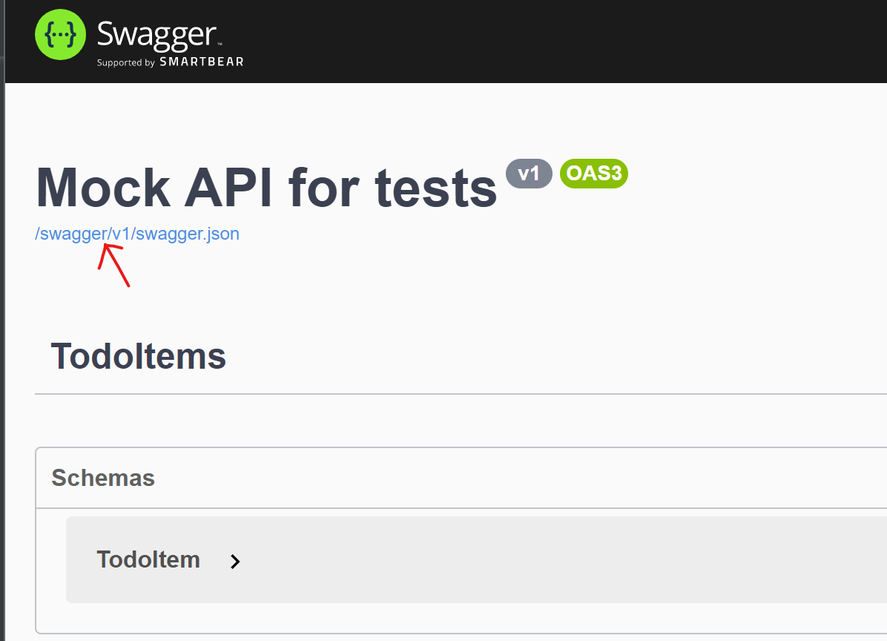

# Application to test Rest API

.Net core application to mock a Rest API on Azure Web Apps.

## Swagger 

Import via OpenAPI tool on Azure API Management.

```
# First go to this page
$host/swagger/index.html

# Then identify the 
$host/swagger/v1/swagger.json
```
As per the picture bellow:
